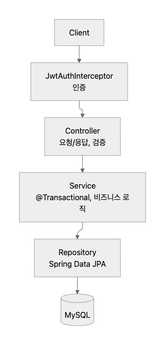
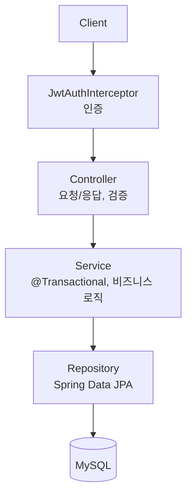
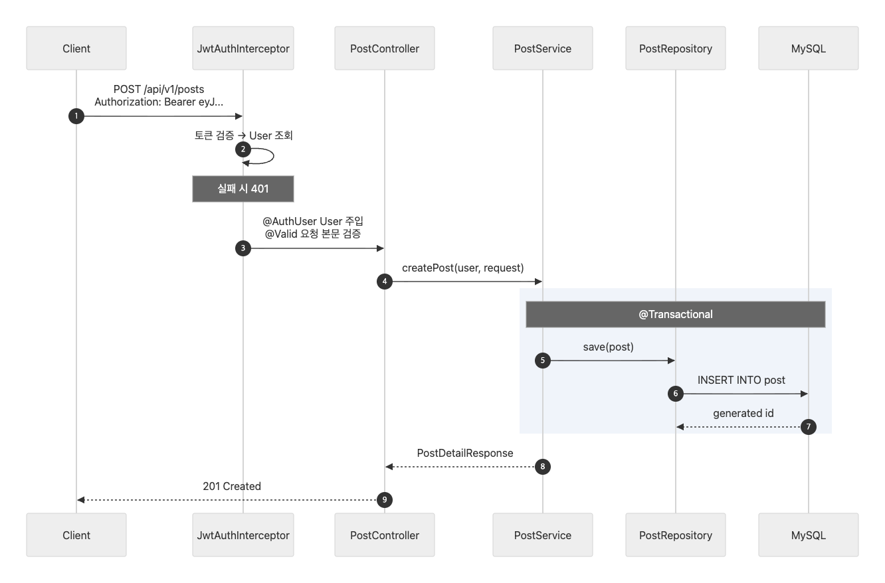
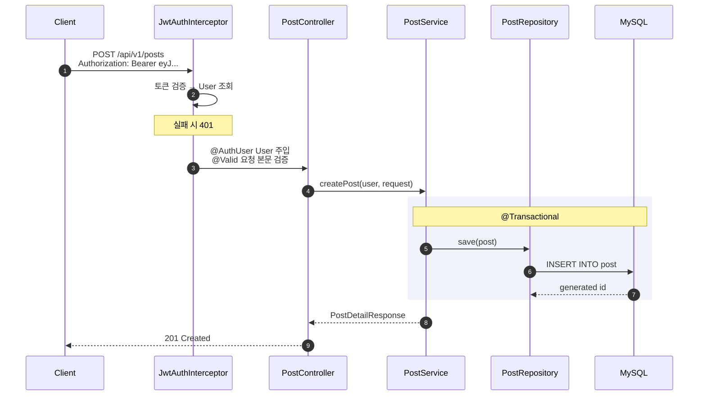

# Architecture

Kotlin + Spring Boot 기반의 레이어드 아키텍처입니다.
패키지는 기술 레이어가 아니라 도메인(`auth`, `user`, `post`, `comment`) 단위로 나눕니다.

 

## 1. 구조도

| 레이어          | 책임                                    |
|:-------------|:--------------------------------------|
| `Controller` | HTTP 매핑, `@Valid` 검증, 상태 코드 결정. 로직 없음 |
| `Service`    | 트랜잭션 경계, 권한 확인, 도메인 규칙, DTO 변환        |
| `Repository` | 쿼리. 파생 쿼리 + `@Modifying @Query` 벌크 연산 |

의존 방향은 단방향입니다. Repository는 Service를 모르고, 엔티티는 DTO를 모릅니다.

 

## 2. 요청 흐름도

`POST /api/v1/posts` (게시글 작성)를 대표 예시로 든 흐름입니다.

